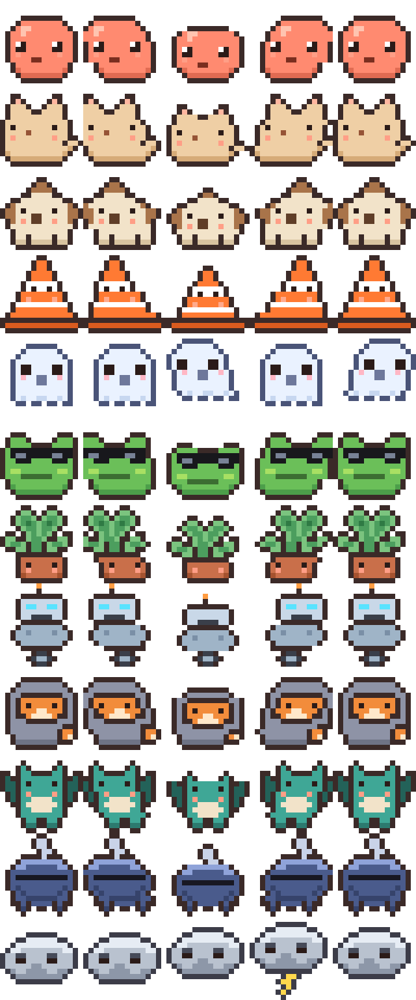

# Scoot

A tiny macOS menu bar buddy that reminds you to move.


Scoot lives quietly in your menu bar and nudges you to get up and move your body
on a set interval — because sitting still all day is bad for your posture, your
mood, and your brain. The nudge itself is the product: a chime, a menu bar
wiggle, or a little pixel buddy that hops into the corner of your screen and
dances until you get up.

Buddies are collectible. Moving earns rolls; rolls reveal new species with
Pokémon-style rarity. **You can't buy a roll — you can only move for one.**

Simple at the core, built for delight, designed to be extended.

## Status

**v0.2 — the buddy is real.** v0.1 (menu bar presence, judgment-heavy interval
scheduler, three nudge styles, settings, launch-at-login, experiment seam) is
verified green on a real Mac. v0.2 adds the collection loop: moving fills the
roll meter, five scoots earn a roll, rolls reveal the 12-species launch cast
with published odds, buddies get named (and become the menu bar icon and nudge
performer), duplicates become sparks. All of it is a plug-in behind the
`ScootFeature` seam — unplug it and the simple nudger remains. Checklist:
[docs/VERIFY.md](docs/VERIFY.md).



## Quickstart (macOS 14+, Command Line Tools only)

```sh
swift build && swift test    # ScootCore's brain runs anywhere; shell needs macOS
scripts/dev-run.sh           # assembles an unsigned Scoot.app and opens it
```

Open `Package.swift` in Xcode if you want the debugger. There is deliberately no
`.xcodeproj` — bundle assembly is `scripts/make-app.sh` (see
[docs/TECHNICAL.md](docs/TECHNICAL.md) §2).

## The docs are the plan

| Doc | What's in it |
|---|---|
| [VISION.md](docs/VISION.md) | The thesis (Tamagotchi × Pokémon × menu bar citizen) and the product constitution |
| [PRODUCT.md](docs/PRODUCT.md) | Core loop, buddy/collection system, nudge catalog, anti-annoyance engineering, onboarding, share surfaces |
| [TECHNICAL.md](docs/TECHNICAL.md) | Architecture decisions, the pure-core/thin-shell split, risks, build pipeline |
| [EXPERIMENTATION.md](docs/EXPERIMENTATION.md) | Delight is empirical: the experiment engine, metrics, first hypotheses |
| [DISTRIBUTION.md](docs/DISTRIBUTION.md) | Direct-download strategy, audience sequencing, the rare-drop calendar |
| [ROADMAP.md](docs/ROADMAP.md) | v0.1 → v0.5 milestones and the expansion arcs (modes, economy, hardware, Windows, local AI) |
| [DESIGN.md](docs/DESIGN.md) | The two-layer aesthetic, pixel art spec, Claude Design workflow + prompts |
| [VERIFY.md](docs/VERIFY.md) | First-run-on-a-real-Mac checklist |
| [RELEASING.md](docs/RELEASING.md) | Signing, notarization, Sparkle, Homebrew runbook |

## Repo map

```
Sources/ScootCore/   pure Swift brain — scheduler reducer, experiments, rarity,
                     sprite formats; builds + tests on Linux CI
Sources/Scoot/       AppKit/SwiftUI shell (canImport-guarded): status item,
                     nudge styles, buddy overlay, settings
Tests/ScootCoreTests programmatic proof the judgment calls work
Support/             Info.plist, entitlements, app icon set
scripts/             asset generator + the no-Xcode build/sign/notarize/DMG path
```

## Principles (the short version)

1. Invisible until helpful — a true menu bar citizen.
2. Delight over guilt — no shame mechanics, ever.
3. Earned randomness, paid determinism — rolls come from movement, money only
   buys exactly what it shows.
4. Free by design — cosmetics fund it, features never gate it.
5. Privacy is table stakes — idle detection stays on-device; telemetry is
   anonymous counts with an honest kill switch.
6. Experimentation is a core feature — the app studies its own delight.

MIT licensed. © The Scoot Authors.
